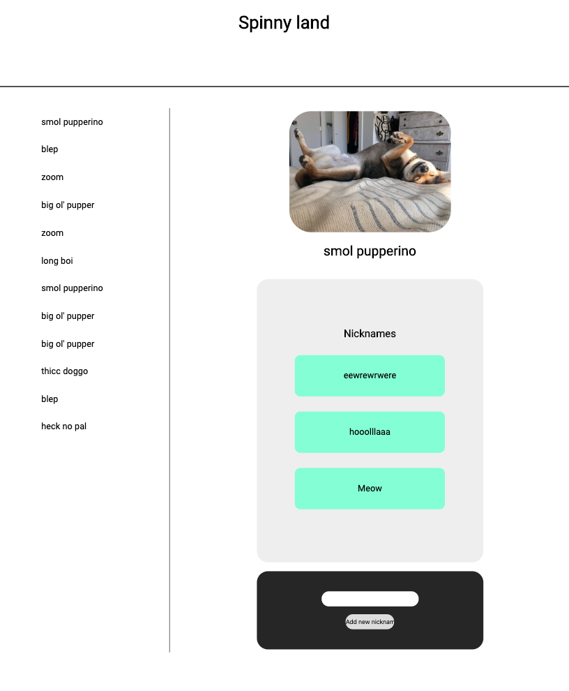

## Deliverables:

1. Fetch all dogs from the API (endpoint = "/dogs") and render a list of each dogs' mood in `#side-bar`
2. When a user clicks an `li` in `#side-bar` it should render that dog's information in `#main-container`
3. When you application first runs `#main-container` should render the _first_ dog instance from the fetched dog instances from the api.
4. A user should be able to see a form in `#main-container` that allows them to add a new nickname to that specific dog.
5. A user should be able to add a new nickname to a dog using the `#new-nickname-form`. To do this, you need to send a POST request to `'/nicknames'` endpoint.
6. A user should be able to see a list of nicknames that belong to the dog in `.nickname-list`

ROUTE: POST '/nicknames'
The headers of request should be:

```
{
    'Content-Type': 'application/json',
    'Accept': 'application/json'
}
```

The body of the request should look like this:

```
{
    dog_id: 1,
    content: "A New Nickname"
}
```

### The main containter should look like this:

```

<h2> Dog Mood Goes Here </h2>
<ul class="nickname-list">
    <h3> Nicknames </h3>
</ul>
<form id="new-nickname-form">
    <input type="text" name="nickname" />
    <input type="submit" value="Add new nickname" />
</form>
```

### Sidebar list items should look like this:

```
<li class='doggo-li'> Dog's mood goes here </li>

```

### Nickname list items should look like this:

```
<li class="nick-li"> Nickname goes here </li>

```

### Finished


